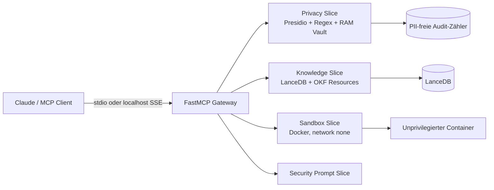

# MCP Enterprise Privacy & Context Gateway

Lokaler, datenschutzorientierter [Model Context Protocol](https://modelcontextprotocol.io/)-Server für Claude Desktop, Claude Code und kompatible MCP-Clients. Das Gateway bündelt PII-Anonymisierung, projektisolierte LanceDB-Suche und eine restriktive Docker-Sandbox.

> **Sicherheits-Hinweis:** Die Sandbox benötigt Zugriff auf den Docker-Daemon (typischerweise `/var/run/docker.sock`). Wer diesen Socket exponiert, gewährt einem kompromittierten Gateway faktisch weitreichende Host-Rechte. Nur lokal und mit bewusstem Vertrauensmodell betreiben.

## Architektur



## Funktionen

| MCP-Primitiv | Zweck |
|---|---|
| `anonymize_prompt` | Erkennt und ersetzt unterstützte PII; erzeugt eine kurzlebige RAM-Session. |
| `deanonymize_response` | Stellt Platzhalter ausschließlich aus einer gültigen Session wieder her. |
| `query_lancedb_vector` | Führt projektisolierte Vektorsuche mit `project_id`-Validierung aus. |
| `execute_docker_code` | Führt Python/JavaScript nur in einem nicht privilegierten, netzwerklosen Container aus. |
| `okf://wiki/{concept_id}` | Liest ein sicheres lokales OKF-Markdown-Konzept. |
| `privacy://audit_stats` | Liefert ausschließlich aggregierte, PII-freie Datenschutzmetriken. |
| `grill_me_security_audit` | Gibt ein deterministisches Security-Audit-Template zurück. |

## Installation

Voraussetzung ist Python 3.11 und `uv`.

```bash
uv venv --python 3.11 .venv
uv sync --extra test
# Optional: ein passendes spaCy-Modell separat installieren; niemals automatisch herunterladen.
```

Der Server startet ohne spaCy-Modell im deterministischen Regex-Fallback-Modus. Für Docker-Ausführung muss der Docker-Daemon laufen und die Images `python:3.11-slim` bzw. `node:20-alpine` müssen lokal vorhanden sein (kein automatischer Pull).

## Start

```bash
.venv/bin/python -m src.server --stdio
MCP_SSE_PORT=8000 .venv/bin/python -m src.server --sse
```

SSE bindet strikt an `127.0.0.1` und ist nicht authentifiziert. Für Claude Desktop:

```json
{
  "mcpServers": {
    "enterprise-gateway": {
      "command": "/home/peppi/coding/mcp-enterprise-gateway/.venv/bin/python",
      "args": ["-m", "src.server", "--stdio"]
    }
  }
}
```

Die Datei liegt zusätzlich als [`claude_desktop_config.json`](./claude_desktop_config.json) im Repository.

## Grenzen und Sicherheit

- Eingaben maximal 100 KiB; `top_k` 1–50; Docker-Timeout 1–30 Sekunden.
- stdout/stderr werden bei 1 MiB abgeschnitten.
- Container: `network_mode=none`, `read_only`, `cap_drop=ALL`, `no-new-privileges`, `user=1000:1000`, `/tmp` als begrenztes `tmpfs`, CPU-/RAM-/PID-Limits.
- Keine Host-Subprocess-Ausführung und kein Mount des Projektverzeichnisses.
- Vault: maximal 1.000 Sessions, TTL 1 Stunde, UUIDv4; Neustart löscht alle Mappings.
- OKF-IDs und `project_id` erlauben nur `[a-zA-Z0-9_-]+`; keine Path-Traversal- oder SQL-Filterstrings.
- Original-PII und Prompts werden nie geloggt.

## Tests

```bash
uv run pytest                 # deterministische Unit-/Contract-Tests
uv run pytest -m integration  # nur mit explizit eingerichteter Umgebung
```

Die Tests mocken Docker und externe Modell-Downloads. LanceDB-/Docker-Integrationstests sind mit `integration` markiert.
