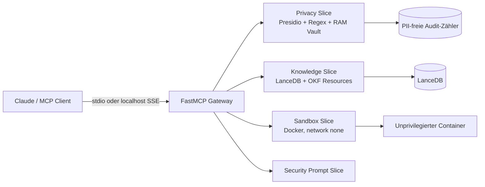

# MCP Enterprise Privacy & Context Gateway

Lokaler, datenschutzorientierter [Model Context Protocol](https://modelcontextprotocol.io/)-Server für Claude Desktop, Claude Code und kompatible MCP-Clients. Das Gateway bündelt PII-Anonymisierung, projektisolierte LanceDB-Suche und eine restriktive Docker-Sandbox.

> **Sicherheits-Hinweis:** Die Sandbox benötigt Zugriff auf den Docker-Daemon (typischerweise `/var/run/docker.sock`). Wer diesen Socket exponiert, gewährt einem kompromittierten Gateway faktisch weitreichende Host-Rechte. Nur lokal und mit bewusstem Vertrauensmodell betreiben.

## Architektur



## Funktionen

| MCP-Primitiv | Zweck |
|---|---|
| `anonymize_prompt` | Erkennt und ersetzt unterstützte PII; erzeugt eine kurzlebige RAM-Session. |
| `deanonymize_response` | Stellt Platzhalter ausschließlich aus einer gültigen Session wieder her. |
| `query_lancedb_vector` | Führt projektisolierte Vektor- oder explizit angeforderte Hybrid-Suche (`search_mode`) mit `project_id`-Validierung aus. |
| `execute_docker_code` | Führt Python/JavaScript nur in einem nicht privilegierten, netzwerklosen Container aus. |
| `okf://wiki/{concept_id}` | Liest ein sicheres lokales OKF-Markdown-Konzept. |
| `privacy://audit_stats` | Liefert ausschließlich aggregierte, PII-freie Datenschutzmetriken. |
| Optionales Audit Studio | `python -m src.audit_studio` startet ein lokales Dashboard auf `127.0.0.1` (Default-Port 8765); dafür muss `AUDIT_STUDIO_TOKEN` mindestens 32 Zeichen lang gesetzt sein. |
| `gateway://health` | Liefert einen begrenzten lokalen Status-/Readiness-Snapshot ohne Geheimnisse. |
| `grill_me_security_audit` | Gibt ein deterministisches Security-Audit-Template zurück. |

## Installation

Voraussetzung ist Python 3.11 und `uv`.

```bash
uv venv --python 3.11 .venv
uv sync --extra test
# Optional: ein passendes spaCy-Modell separat installieren; niemals automatisch herunterladen.
```

Der Server startet ohne spaCy-Modell im deterministischen Regex-Fallback-Modus. Für Docker-Ausführung muss der Docker-Daemon laufen und die Images `python:3.11-slim` bzw. `node:20-alpine` müssen lokal vorhanden sein (kein automatischer Pull).

## Start

```bash
.venv/bin/python -m src.server --stdio
MCP_SSE_PORT=8000 .venv/bin/python -m src.server --sse
```

SSE ist standardmäßig nicht freigeschaltet: `--sse` erfordert `MCP_SSE_TOKEN` (mindestens 32 Zeichen), bindet ausschließlich an `127.0.0.1` und sollte nicht geteilt betrieben werden. Für Multi-Projekt-Betrieb zusätzlich `MCP_ALLOWED_PROJECTS=project-a,project-b` setzen. Für Claude Desktop:

```json
{
  "mcpServers": {
    "enterprise-gateway": {
      "command": "/home/peppi/coding/mcp-enterprise-gateway/.venv/bin/python",
      "args": ["-m", "src.server", "--stdio"]
    }
  }
}
```

Die Datei liegt zusätzlich als [`claude_desktop_config.json`](./claude_desktop_config.json) im Repository.

## Grenzen und Sicherheit

- Eingaben maximal 100 KiB; `top_k` 1–50; Docker-Timeout 1–30 Sekunden.
- `anonymize_prompt` unterstützt `strategy=placeholder|redact|hash`, `on_secret=mask|block` sowie jeweils maximal 50 Whitelist-/Blacklist-Begriffe mit höchstens 100 Zeichen. Technische Secrets (AWS/OpenAI/Anthropic/GitHub, Private Keys, JWTs und Connection Strings) werden im Maskierungsmodus als Secret-Entitäten erkannt; `on_secret=block` blockiert AWS-Keys, Private Keys und Connection Strings. Whitelist-Abgleiche sind literal; Blacklist-Treffer überschreiben die Whitelist und werden als `<CUSTOM_n>` maskiert.
- stdout/stderr werden bei 1 MiB abgeschnitten.
- Container: `network_mode=none`, `read_only`, `cap_drop=ALL`, `no-new-privileges`, `user=1000:1000`, `/tmp` als begrenztes `tmpfs`, CPU-/RAM-/PID-Limits.
- Keine Host-Subprocess-Ausführung und kein Mount des Projektverzeichnisses.
- Für Sandbox-Betrieb: `MCP_REQUIRE_IMAGE_DIGEST=1` (Default), `MCP_PYTHON_IMAGE` und `MCP_NODE_IMAGE` als verifizierte `@sha256:`-Referenzen konfigurieren; die Default-Digests sind fail-closed Platzhalter. Images werden nie automatisch gepullt.
- Build-/Lockfile- und Coverage-Gates laufen in CI; SBOM/Provenienz der digest-gepinnten Release-Images ist vor Deployment zu attestieren.
- Vault: maximal 1.000 Sessions, TTL 1 Stunde, UUIDv4; Neustart löscht alle Mappings.
- OKF-IDs und `project_id` erlauben nur `[a-zA-Z0-9_-]+`; keine Path-Traversal- oder SQL-Filterstrings.
- Original-PII und Prompts werden nie geloggt.

## Tests

```bash
uv run pytest                 # deterministische Unit-/Contract-Tests (ohne Integration)
uv run pytest --cov=src --cov-report=term-missing --cov-fail-under=85
uv run pytest -m integration  # explizite Integrationsspur (Docker/LanceDB optional)
uv build                      # Packaging-Smoke-Test
```

Die Tests mocken Docker und externe Modell-Downloads. LanceDB-/Docker-Integrationstests sind mit `integration` markiert.

### Konfiguration

- `OKF_ROOT`: lokaler Pfad zu Markdown-Ressourcen (maximal 1 MiB je Datei).
- `LANCEDB_PATH` und `LANCEDB_TABLE`: optionale lokale LanceDB-Konfiguration; `LocalHashEmbedder` ist deterministisch und lädt nichts aus dem Netz.
- Ohne ein explizit installiertes spaCy-/Presidio-Modell läuft der dokumentierte `regex_fallback`. Unterstützt werden `de`, `en`, `fr`, `it` und `es`, einschließlich aller ISO-IBAN-Länder via Modulo-97-Prüfung, E.164-Telefonnummern und lokalisierter Namenspräfixe. Modelle werden niemals automatisch geladen; `privacy://audit_stats` weist den Modus je Sprache aus.
- `privacy://audit_stats` zählt maskierte Erkennungen als `blocked_pii_types`; Werte, Prompts und Session-IDs werden nicht ausgegeben. Nur `placeholder` erzeugt eine deanonymisierbare RAM-Session; `redact` und `hash` sind nicht rückführbar.
- Hybrid-Suche setzt einen LanceDB-FTS/BM25-Index auf `text` voraus. Ist er nicht vorhanden, liefert `search_mode="hybrid"` den kontrollierten Fehler `knowledge_hybrid_unavailable`; es gibt keinen stillen Vector-Fallback.
- Audit Studio ist ausschließlich eine optionale lokale Einzelbenutzer-UI. Es darf nicht als authentifiziertes Multi-Tenant-Dashboard exponiert werden.
- Fehlerantworten sind absichtlich generisch und enthalten keine Stacktraces, Pfade oder Backenddetails.

SSE bleibt ein lokaler Hochrisiko-Transport, weil Docker-Ausführung und kurzlebige Deanonymisierung angeboten werden. Für produktiven Mehrbenutzerbetrieb sind zusätzliche Authentifizierung, Projekt-Principal-Bindung und Rate-Limits erforderlich.

### Schnelltest

```bash
uv run python examples/client_test.py
```

Zusätzlich stellt `dsgvo_pii_risk_audit` ein begrenztes MCP-Prompt-Template für Datenschutz-Risikoanalysen bereit. Die Health-Resource ist bewusst nur ein lokaler Status-Snapshot; sie ersetzt kein externes Monitoring.

## Architekturentscheidungen

- [ADR-001: Expliziter LanceDB-Hybrid-Search-Modus](docs/ADR-001-hybrid-search.md)
- [ADR-002: Optionales lokales Audit Studio](docs/ADR-002-audit-studio.md)
